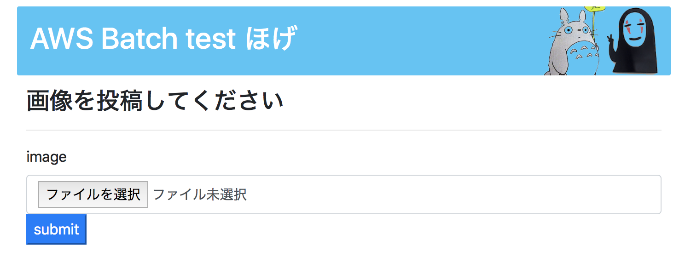

## aws batch example



#### make image transparent

```bash
$ brew install imagemagick

# msrks: -fuzz 30%
$ convert input.jpeg -fuzz 5% -transparent white mitsu.png
```

#### upload image to s3

```bash
$ aws s3 cp output.png s3://msrks/transparent.png --acl public-read
```

#### make s3 website

```bash
$ aws s3 website s3://${BUCKET_NAME} --index-document index.html
```
